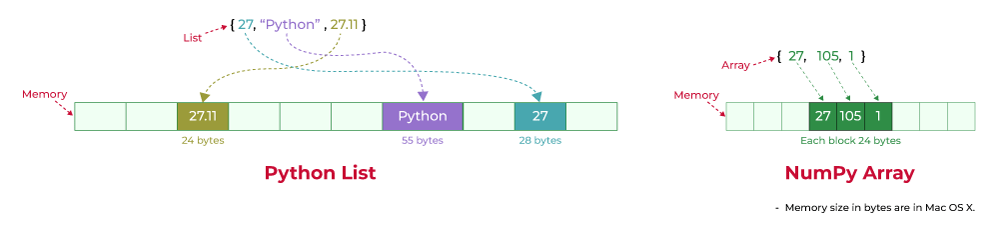

# let-s_learn_numpy

## What Are Python Arrays?
`Python’s array module` provides typed arrays (all elements must be of the same type).
-> More memory-efficient than lists for large datasets of uniform data types.
-> Unlike lists, arrays cannot mix types (e.g., integers and strings).
# EXAMPLE :
```python
from array import array
# Syntax: array(typecode, [elements])
arr = array('i', [1, 2, 3, 4, 5])  # 'i' for integers
```
Type Code: Data Type
'i': Signed integer
'f': Float
'd': Double
'u': Unicode char
...    ...
# LIMITATIONS:
->All elements must be of the same type.
->Only 1D Arrays; Cannot create multi-dimensional arrays (e.g., matrices).
->Cannot perform operations on entire arrays without loops.
->Requires type codes (e.g., 'i', 'd'), which can be confusing.
->Less intuitive than NumPy for numerical work.

## WHy NUMPY ?
`NumPy (Numerical Python)` is the backbone of scientific computing in Python. Here’s why it’s indispensable:

`Speed`: NumPy is written in C and optimized for performance. Operations on NumPy arrays are much faster than Python lists.
Memory 
`Efficiency`: NumPy arrays store data more compactly than Python lists, saving memory.
`Convenience`: It provides a vast collection of mathematical functions to operate on arrays without writing loops.
`Foundation for Other Libraries`: Libraries like Pandas, Matplotlib, and SciPy are built on top of NumPy.

## WHAT IS NUMPY ?
`Numpy is not another programming language` but a Python extension module.
`NumPy is a library` for working with arrays and matrices. It allows you to perform mathematical operations on entire arrays without writing loops.
 
## When Should You Use NumPy?

# Use NumPy for:

Numerical computations (math, statistics, physics, etc.).
Working with large datasets (e.g., images, signals, matrices).
Any task involving arrays or matrices.

# Use Python Lists for:

General-purpose tasks (e.g., storing mixed data types).
Small datasets where NumPy’s overhead isn’t justified.

## NUMPY ARRAYS vs PYTHON LISTS??:
# `Python Lists`

What they are: Built-in Python containers for storing collections of items (e.g., numbers, strings, mixed types).
Memory: Stores each item as a separate object → more memory (slower for big data).
Speed: Uses Python loops → slower for math operations.
Use when: You need flexibility (e.g., mixed data types, small datasets).
```python
import numpy as np
str = ["HI", 13, "Imane"]
print(str)
=> output : ["HI", 13, "Imane"]
```

`Technical Explanation`

* Python lists store each item as a separate object in memory.
* Each object has extra info (like its type, reference count, etc.).
* When you loop over a list, Python has to fetch each object one by one from different memory locations.
* Elements can be of different types.

# `NumPy Arrays`

What they are: Specialized containers for numerical data (from the numpy library).
Memory: Stores data in a single block → less memory (faster for big data).
Speed: Uses vectorized operations (no loops) → much faster for math.
Use when: You work with numbers, matrices, or large datasets.
```python
a = np.array([10, 5, 60])
print(a)
=> output : [10 5 60]
```

# Technical Explanation

* NumPy arrays store all elements in a single, contiguous block of memory.
* All elements are of the same type (e.g., all int32 or float64).
* No extra overhead for pointers or type info.
* All elements must be of the same type .


## What Does "Vectorized" Mean??
`Vectorization` means applying an operation to entire arrays at once, without writing loops.
NumPy does this by calling optimized C/Fortran code under the hood.
             `No Python loops = much faster.`
-> Python loops are interpreted, meaning Python checks each step (type, memory, etc.).
-> NumPy bypasses Python and uses pre-compiled C code for operations.

# EXAMPLE:
```python
import numpy as np

# Without vectorization (slow)
my_list = [1, 2, 3]
squared_list = [x**2 for x in my_list]  # Python loop

# With vectorization (fast)
my_array = np.array([1, 2, 3])
squared_array = my_array ** 2  # NumPy does it all at once!
```
## Getting started with numpy:

each file represent an exercice with my own solution

26:24 - 11.)
29:35 - 
30:48 - 
33:17 - 
34:57 - 
40:19 - 16.) How to add a border (filled with 0’s around an existing array? (np.pad)
43:41 - 17.) Evaluate some np.nan expressions
48:32 - 18.) Create a 5x5 matrix with values 1,2,3,4 just below the diagonal
56:01 - 19.) Create an 8x8 matrix and fill it with a checkerboard pattern
1:02:35 - 20.)  Get the 100th element from a (6,7,8) shape array
1:07:09 - 21.) Create a checkerboard pattern 8x8 matrix using np.tile function
1:16:22 - 22.) Normalize a random 5x5 matrix
1:24:20 - 23.) Create a custom dtype that describes a color as four unsigned bytes (RGBA)
1:29:27 - 24.) Multiply a 5x3 matrix by a 3x2 matrix (real matrix product)
1:32:54 - 25.) Given a 1D array, negate all elements which are between 3 and 8, in place
1:37:16 - 26.) Default “range” function vs numpy “range” function
1:40:25 - 27.) Evaluate whether expressions are legal or not
1:55:41 - 28.) Evaluate divide by zero expressions / np.nan type casting
1:57:48 - 29.) How to round away from zero a float array?
1:59:22 - 30.) How to find common values between two arrays?
2:00:19 - 31.) How to ignore all numpy warnings?
2:03:24 - 32.) Is np.sqrt(-1) == np.emath.sqrt(-1) ??
2:05:22 - 33.) Get the dates of yesterday, today, and tomorrow with numpy
2:19:39 - 34.) How to get all the dates corresponding to the month of July 2016?
2:27:27 - 35.) How to compute ((A+B)*(-A/2)) in place (without copy)?
2:35:00 - 36.) Extract the integer part of a random array of positive numbers using 4 different methods
2:40:47 - 37.) Create a 5x5 matrix with row values ranging from 0 to 4
2:43:07 - 38.) Use generator function that generates 10 integers and use it to build an array
2:43:58 - 39.) Create a vector of size 10 with values ranging from 0 to 1, both excluded.
2:48:49 - 40.) Create a random vector of size 10 and sort it.
2:51:07 - 41.) How to sum a small array faster than np.sum? 
2:54:37 - 42.) Check if two random arrays A & B are equal
2:58:48 - 43.) Make an array immutable (read-only)
3:02:14 - Puppies are great
3:03:06 - 44.) Convert cartesian coordinates to polar coordinates
3:20:37 - 45.) Create a random vector of size 10 and replace the maximum value by 0
3:23:58 - 46.) Create a structured array with x and y coordinates covering the [0,1]x[0,1] area
3:26:25 - 47.) Given two arrays, X and Y, construct the Cauchy matrix C (Cij = 1/(xi-yj))
3:34:31 - 48.) Print the min/max values for each numpy scalar type
3:36:50 - 49.) How to print all the values of an array?
3:39:23 - 50.) How to find the closest value (to a given scalar) in a vector? 